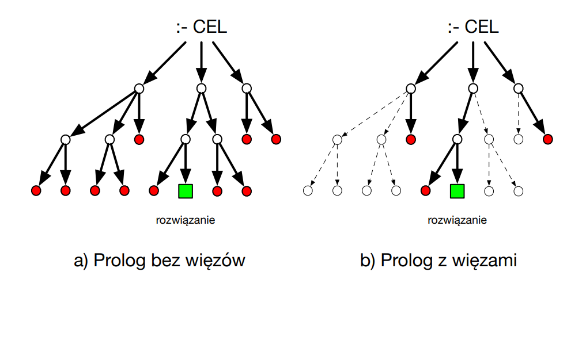
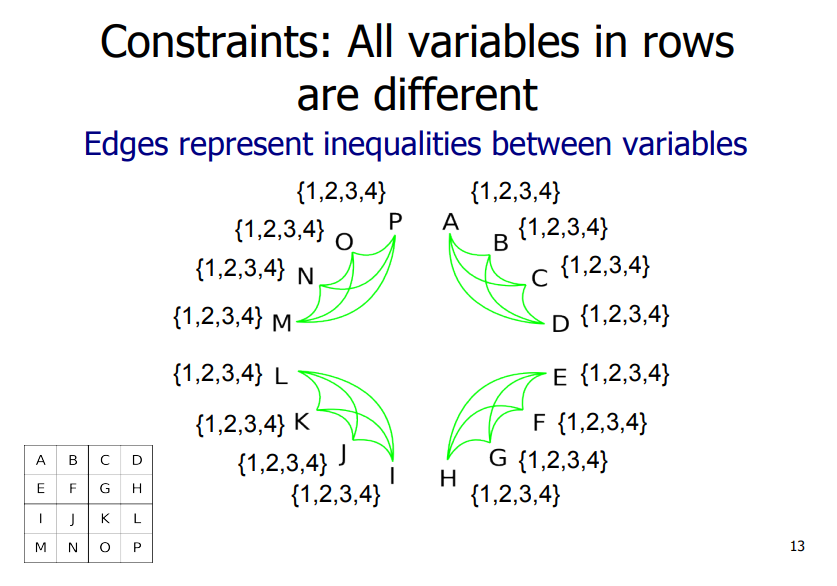
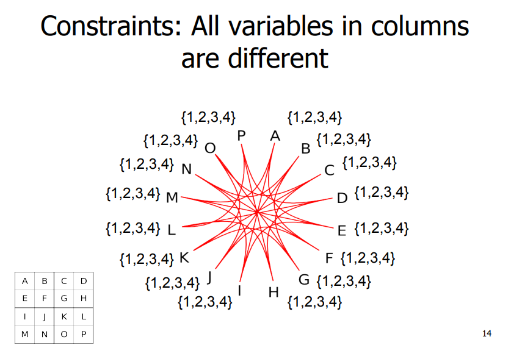
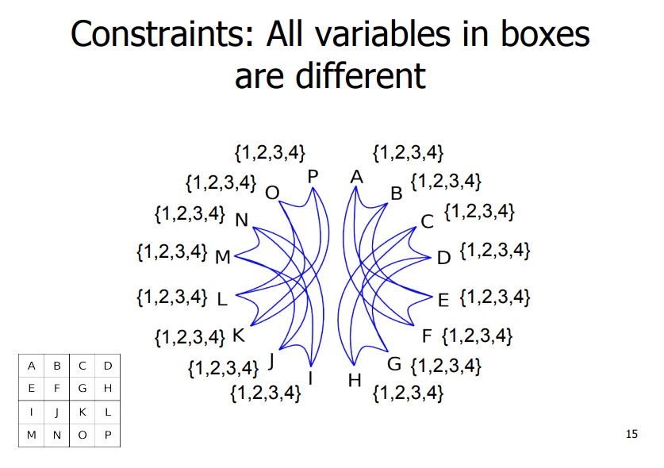
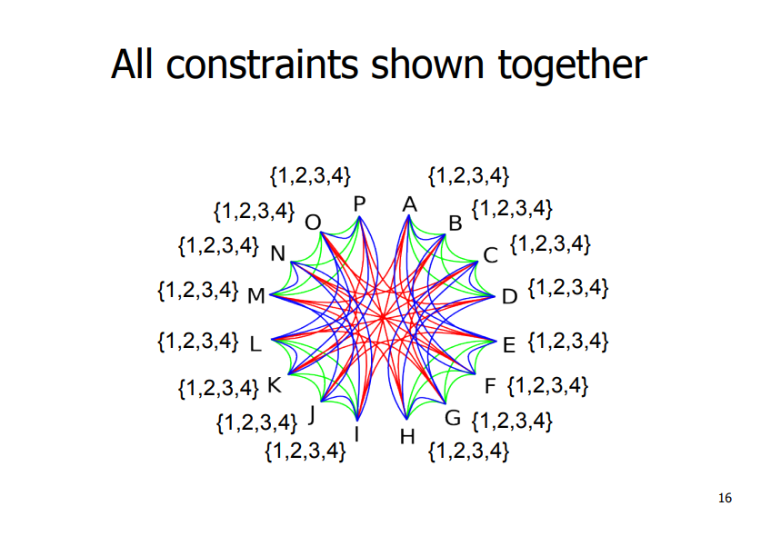
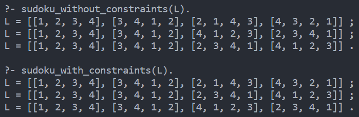
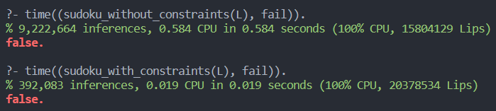

#### Autor: Joanna Kulig, 261738

### W jaki sposób programowanie ograniczeń może przyspieszyć działanie Prologu?

Rozwiązując zapytanie, Prolog za każdym razem stara się dopasowywać wartości zmiennych do danych definicji, warunków czy przynależności. Naturalnie przeszukuje on możliwe rozwiązania, 'wyrzucając' ze zbioru znalezionych te, które nie spełniają naszych oczekiwań zawartych w kodzie.

Z pomocą przychodzi nam **CLC** - Constraint Logic Programming, czyli programowanie ograniczeń. Pozwala nam ono na określenie dziedziny zmiennych, przez co rozwiązania problemów są efektywnie zawężane. Ograniczenia biorą pod uwagę wszystko, co zdefiniowaliśmy dla danych zmiennych, niezależnie od kolejności ich zdefiniowania. Są one odświeżane także podczas wykonywania programu. Jest to tzw. propagowanie ograniczeń, które jest dokonywane automatycznie. To wszystko sprawia, że zwiększa się wydajność pisanych programów, szczególnie jeśli bierzemy pod uwagę czas oraz liczbę dokonanych operacji podczas wykonywania programu.


_Rysunek 1. Szukanie rozwiązań w programach bez użycia / z użyciem programowania ograniczeń._

Na powyższym obrazku widać sposób dojścia do rozwiązania. Prolog bez więzów przechodzi każde rozwiązanie, do którego możemy dojść mając zadane warunki, odrzucając je jedynie wtedy, gdy dojdziemy do ich wartości i wtedy przyrównamy do naszego celu. Natomiast Prolog z więzami, podczas wykonywania programu, dynamicznie odrzuca niepasujące możliwości, jeszcze zanim dojdzie do ich ewaluacji. Jest to możliwe za pomocą wyżej wyjaśnionego propagowania ograniczeń, które są odświeżane w czasie wykonywania programu.

#### Przykłady działania:

Każdy przykład zakłada, że jest już (tam, gdzie potrzeba) zdefiniowany moduł dostarczający więzy.

```Prolog
?- [X,Y] ins 0..3, Z #= X + Y, Z #= 1.
Z = 1,
X in 0..1,
X+Y#=1,
Y in 0..1.
```

Powyższy przykład pokazuje automatyczne dostosowanie dziedzin zmiennych do danego problemu poprzez łączenie ograniczeń. Jest to doskonały przykład odświeżania ograniczeń na danych zmiennych, czyli jednej z własności programowania ograniczeń.

Aby pokazać programowanie ograniczeń w pełnej krasie, wzięłam bardziej skomplikowany przykład - podawanie możliwych rozwiązań sudoku 4x4. Możemy przyjrzeć się najpierw rozwiązaniu bez ograniczeń.

```prolog
% sudoku 4x4
% | X11 | X12 | X13 | X14 |
% | X21 | X22 | X23 | X24 |
% | X31 | X32 | X33 | X34 |
% | X41 | X42 | X43 | X44 |

% list of solutions represented by four rows, from top to bottom
sudoku_without_constraints([[X11,X12,X13,X14], [X21,X22,X23,X24], 
  [X31,X32,X33,X34], [X41,X42,X43,X44]]) :-
  Digits = [1,2,3,4],
  % rows
  permutation([X11,X12,X13,X14], Digits),
  permutation([X21,X22,X23,X24], Digits),
  permutation([X31,X32,X33,X34], Digits),
  permutation([X41,X42,X43,X44], Digits),
  % columns
  permutation([X11,X21,X31,X41], Digits),
  permutation([X12,X22,X32,X42], Digits),
  permutation([X13,X23,X33,X43], Digits),
  permutation([X14,X24,X34,X44], Digits),
  % squares
  permutation([X11,X12,X21,X22], Digits),
  permutation([X13,X14,X23,X24], Digits),
  permutation([X31,X32,X41,X42], Digits),
  permutation([X33,X34,X43,X44], Digits).
```

W powyższym rozwiązaniu, każdy wiersz, kolumna oraz kwadrat są zdefiniowane za pomocą predykatu _permutation/2_, który następnie szuka permutacji zgodnych z zadanymi warunkami (czyli że ma to być permutacja z liczb od 1 do 4 oraz że jest ona uformowana z 4 zadanych zmiennych, reprezentujących komórki w sudoku). Jednak podczas wywołania sprawdzane są również te możliwości, które składają się np. z samych 1, lub dla każdego wywołania predykatu porównujemy go z tymi samymi wynikami:

```Prolog
[trace]  ?- sudoku_without_constraints(L).
  [...]
  Call: (9) lists:permutation([1, 1, 1, 1], [1, 2, 3, 4]) ? creep
  Fail: (9) lists:permutation([1, 1, 1, 1], [1, 2, 3, 4]) ? creep
  Redo: (9) lists:permutation([1, 2, 4, 3], [1, 2, 3, 4]) ? creep
  Exit: (9) lists:permutation([1, 3, 2, 4], [1, 2, 3, 4]) ? creep
  Call: (9) lists:permutation([1, 1, 1, 1], [1, 2, 3, 4]) ? creep
  Fail: (9) lists:permutation([1, 1, 1, 1], [1, 2, 3, 4]) ? creep
  Redo: (9) lists:permutation([1, 3, 2, 4], [1, 2, 3, 4]) ? creep
  [...]
  Call: (9) lists:permutation([1, 1, 1, 2], [1, 2, 3, 4]) ? creep
  Fail: (9) lists:permutation([1, 1, 1, 2], [1, 2, 3, 4]) ? creep
  Redo: (9) lists:permutation([2, 3, 1, 4], [1, 2, 3, 4]) ? creep
```

Następnie możemy rozważyć przykład, w którym zastosowaliśmy programowanie ograniczeń.

```Prolog
:- use_module(library(bounds)).

valid(L) :-
  L in 1..4,
  all_different(L).

sudoku_with_constraints([[X11,X12,X13,X14], [X21,X22,X23,X24],
  [X31,X32,X33,X34], [X41,X42,X43,X44]]) :-
  % rows
  valid([X11,X12,X13,X14]),
  valid([X21,X22,X23,X24]),
  valid([X31,X32,X33,X34]),
  valid([X41,X42,X43,X44]),
  % columns
  valid([X11,X21,X31,X41]),
  valid([X12,X22,X32,X42]),
  valid([X13,X23,X33,X43]),
  valid([X14,X24,X34,X44]),
  % squares
  valid([X11,X12,X21,X22]),
  valid([X13,X14,X23,X24]),
  valid([X31,X32,X41,X42]),
  valid([X33,X34,X43,X44]),
  labeling([], [X11,X12,X13,X14,X21,X22,X23,X24,X31,X32,X33,X34,X41,X42,X43,X44]).
```

Powyżej predykat _valid/1_ zapewnia nam potrzebne ograniczenia dla każdego 'podzbioru' pól sudoku, np. dla _valid([X11,X12,X13,X14])_, każda z wartości listy ma być w przedziale od 1 do 4 (włącznie) oraz muszą być one parami różne, co sprawi, że każda z nich będzie miała osobną wartość. Dzięki automatycznemu dostosowywania dziedzin, możemy dostać poniższe ograniczenia:


_Rysunek 2. Przedstawienie zależności między wartościami w rzędach._


_Rysunek 3. Przedstawienie zależności między wartościami w kolumnach._


_Rysunek 4. Przedstawienie zależności między wartościami w małych kwadratach._


_Rysunek 5. Przedstawienie wszystkich zależności jednocześnie._

Mając takie ograniczenia przy, np. zdefiniowaniu jednej wartości, możemy przechodzić po zależnościach i ograniczeniach związanych z tą wartością, aby efektywnie znaleźć szukane rozwiązanie.

Wywołanie obu funkcji:


_Rysunek 6. Wywołanie programów pokazujących rozwiązania sudoku 4x4._


_Rysunek 7. Czas oraz liczba kroków wnioskowania dla obu programów._

#### Źródła:

https://cs.pwr.edu.pl/kobylanski/dydaktyka/resources/pl_wyk11A4.pdf
https://www.swi-prolog.org/pldoc/man?section=clp
https://www.metalevel.at/prolog/clpz
https://www.cl.cam.ac.uk/teaching/0809/Prolog/Prolog08ML6R2.pdf
